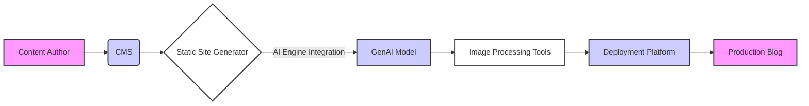
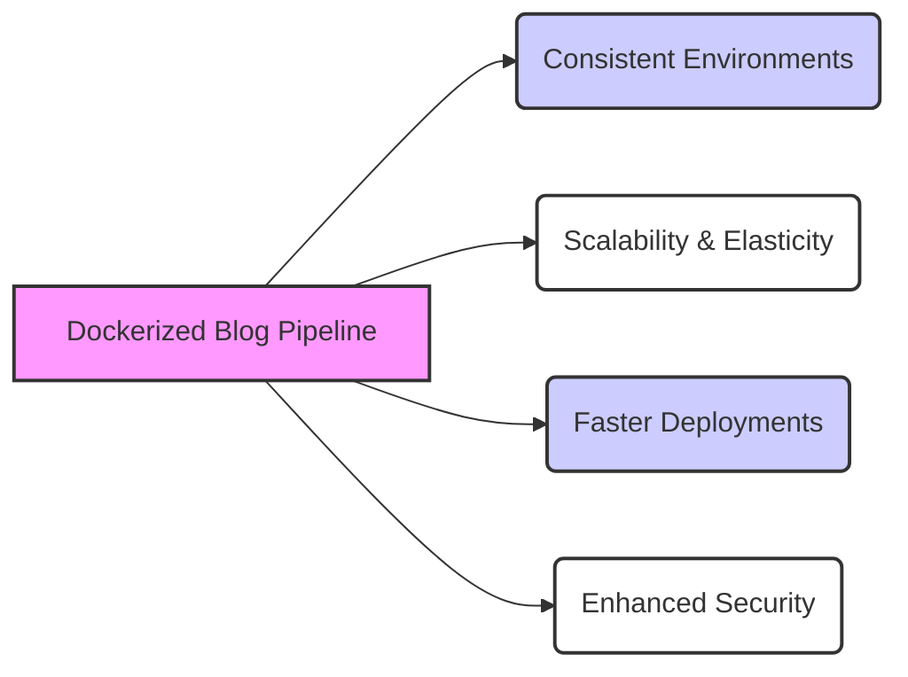
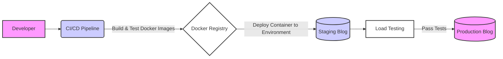

## The Rise of Containerization & Blog Generation in DevOps 

The modern digital landscape demands constant content updates, rapid iteration cycles, and unwavering uptime. For blogs—a cornerstone of many businesses’ online presence—this translates to a need for efficient development, testing, and deployment pipelines. Traditional approaches often stumble under the weight of dependencies, environment inconsistencies, and manual configuration drift.

Enter Docker: The de facto standard for containerization has revolutionized software delivery by packaging applications with all their dependencies into isolated units called containers. These containers ensure that an application runs consistently across different environments—from a developer's laptop to production servers. This predictability is invaluable in the context of blog generation, where content creation workflows often involve multiple tools and services.

The trend towards automated blog generation, often leveraging AI (GenAI), further complicates matters. Managing these complex pipelines necessitates robust testing strategies and streamlined deployment processes.  This article dives deep into how Dockerization can be applied to blog generation workflows, focusing on the crucial aspects of thorough testing and reliable deployments.

## The Challenge

## The Challenges of Testing Blog Generation Pipelines

The inherent complexity in modern blog generation setups presents significant challenges for quality assurance teams. These pipelines often involve a CMS (Content Management System), static site generators, image processing tools, AI-powered content creation engines, and deployment platforms—all interconnected and dependent on each other.

Traditional testing methods struggle to keep pace with this dynamic environment. Manual testing is time-consuming and prone to human error.  Environment inconsistencies can lead to bugs that only manifest in specific setups, making them difficult to reproduce and debug. Furthermore, the increasing reliance on AI for content generation introduces new complexities related to output quality, bias detection, and factual accuracy.

The core problem lies in ensuring a consistent testing environment across development, staging, and production—a challenge exacerbated by the integration of external services like GenAI models.  Without proper isolation and automation, testing becomes unreliable, leading to delayed releases and potentially compromised content quality.

Here’s a visual representation illustrating this complexity:

## Why This Matters

## Why Dockerization Matters for Blog Generation Success 

The benefits of adopting a Dockerized approach to blog generation extend far beyond simply improving testing efficiency. It's about creating a more resilient, scalable, and maintainable content creation pipeline.

Firstly, **consistency** is paramount.  Docker eliminates the “works on my machine” problem by ensuring that every component runs in an identical environment regardless of where it’s deployed. This significantly reduces debugging time and prevents unexpected issues in production.

Secondly, **scalability** becomes much easier to manage. With Docker containers, you can easily scale individual components based on demand—for example, scaling up the image processing container during peak traffic or increasing instances of your static site generator for increased load. This elasticity is crucial for handling fluctuating blog readership.

Thirdly, **faster deployments and improved collaboration** are a direct result of automated build and deployment processes enabled by Docker. Developers can work independently in their own containers without interfering with each other's workflows.  As noted on [mailcow’s dockerized blog](https://mailcow.email/), community feedback is invaluable—and Docker facilitates that through rapid iteration cycles.

Finally, **enhanced security** can be achieved by isolating components within their respective containers and applying appropriate security policies. This minimizes the impact of potential vulnerabilities in one component on other parts of the pipeline.

Here's a diagram illustrating these benefits:

## Strategic Solutions

## Dockerizing Your Blog Generation Pipeline: A Practical Approach 

The good news is that Docker provides a powerful solution to these challenges. By containerizing each component of the blog generation pipeline—from the CMS and static site generator to the AI engine and deployment platform—we can create isolated, reproducible environments for testing.

Here's a breakdown of practical strategies:

**1. Containerize Each Component:** Create separate Docker containers for your CMS (e.g., WordPress, Drupal), static site generator (e.g., Hugo, Jekyll, Next.js), AI content creation tools, and any image processing pipelines. This ensures that each component runs in a consistent environment regardless of the underlying infrastructure.

**2. Automated Environment Provisioning:** Utilize Docker Compose or Kubernetes to orchestrate these containers and define their dependencies. This allows you to easily spin up entire testing environments with a single command, ensuring consistency across teams and stages.

**3. Load Testing & Performance Monitoring:** As highlighted by [Gatling’s blog on load testing dockerized applications](https://gatling.io/blog/load-testing-a-dockerized-application), subjecting your containerized application to realistic loads is crucial for identifying bottlenecks and ensuring scalability. Tools like Gatling can be integrated into your CI/CD pipeline to automate this process.

**4. Integration Testing with AI Models:**  When integrating GenAI models, ensure you have robust integration tests that evaluate the quality of generated content. This includes testing for factual accuracy, bias detection (as discussed in [our article on securing GenAI](https://blog.nashtechglobal.com/containerized-testing-docker-izing-test-environments-for-devops/)), and adherence to brand guidelines.

**5. CI/CD Integration:**  Automate the entire build, test, and deployment process using a CI/CD pipeline (e.g., Jenkins, GitLab CI). This ensures that every code change triggers automated tests and deployments, reducing manual intervention and accelerating release cycles. You can even leverage Docker's multi-stage builds to optimize image sizes.

**6. Utilizing Test Containers:**  Consider frameworks like [Testcontainers](https://testcontainers.org/) which provide prebuilt containers for databases, message brokers, and other dependencies commonly used in blog generation pipelines. These streamline setup and teardown during testing.

Here's a diagram illustrating the containerized pipeline:

## Key Takeaways and Next Steps

# Conclusion & Future Directions

The shift towards containerized applications is undeniable, and Docker plays a pivotal role in enabling this transformation. By embracing the strategies outlined above – from robust load testing to automated environment provisioning—blog generation workflows can achieve unprecedented levels of reliability, scalability, and speed.

At Runink, we're dedicated to providing AI-powered automation solutions that streamline complex processes like content creation and distribution. Our AI assistant helps logistics teams make smarter modal-shift decisions by integrating real-time rail and road data [(/blog/runink-ai-modal-shift-optimization)]. Consider how similar principles of intelligent optimization can be applied to your blog generation pipeline.

Are you ready to modernize your blog creation process? Contact us today to learn more about leveraging AI and Docker for a seamless content lifecycle. Let's build the future of blogging, together!

