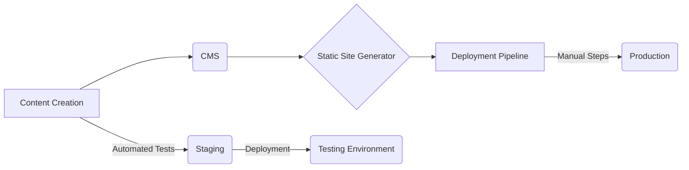
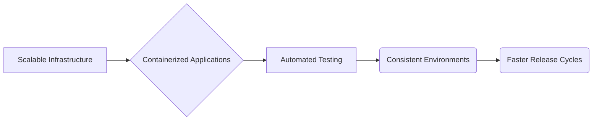
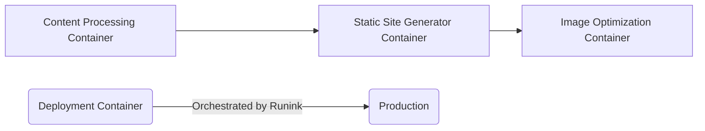

The world of digital publishing is evolving rapidly. Blog generation, once a largely manual process, now demands increasing speed, scalability, and consistency to meet the constant demand for fresh content across multiple platforms. Traditional blog creation workflows often involve complex dependencies on various tools – content management systems (CMS), static site generators, image editors, and deployment pipelines. This complexity can lead to bottlenecks, inconsistent environments, and challenges in testing and automation.

Enter Docker: a containerization technology that has revolutionized software development practices across the board. By packaging blog generation applications and their dependencies into isolated containers, we can achieve greater portability, reproducibility, and scalability.  This article delves into the benefits of dockerizing your blog generation workflows, addresses common challenges, and explores practical solutions for achieving automated testing and efficient deployments.

We'll explore how Docker integrates with various stages of a typical blog creation lifecycle, from content drafting to deployment. Furthermore, we’ll examine the critical role of tools like Gatling in load testing dockerized applications and discuss emerging trends such as leveraging AI within containerized environments – techniques that can significantly enhance productivity and quality.

The current state of many blog generation workflows is characterized by fragility and inconsistency. Different developers may set up their local development environments differently, leading to 'it works on my machine' scenarios during integration.  Deployment processes are often manual, error-prone, and difficult to automate reliably. Testing becomes a significant challenge – ensuring that generated content renders correctly across various platforms requires extensive manual checks or complex testing setups.

The core issue lies in the lack of isolation and standardization within these workflows. Dependencies on specific versions of software packages, operating system configurations, and environment variables create an unstable foundation for development and deployment. This ultimately results in increased costs associated with debugging production issues, delayed releases, and inconsistent user experiences.

The benefits of Dockerizing blog generation workflows extend far beyond simply improving developer productivity.  A well-implemented containerized architecture significantly enhances scalability, reliability, and security. By isolating applications within containers, we reduce the risk of conflicts between different software versions and dependencies.

Furthermore, automated testing becomes much easier to implement and maintain. Consistent environments across development, staging, and production ensure that tests reliably reflect real-world conditions. This leads to fewer bugs in production and a faster release cycle.

The ability to rapidly scale blog generation infrastructure is also crucial for handling sudden traffic surges or seasonal content campaigns. Docker containers can be spun up or down on demand, providing the flexibility needed to adapt to changing workloads.  This aligns with principles of [improving cloud ROI](/blog/improving-cloud-roi-finops-domain-model-data-mesh) by optimizing resource utilization and reducing waste.

Finally, Dockerization plays a key role in bolstering security posture. By limiting access to system resources and dependencies within containers, we reduce the attack surface and minimize the impact of potential vulnerabilities.  This is particularly important given the increasing focus on [securing generative AI](/blog/information-security-ethical-gen-ai-logistics) - maintaining robust data governance and access controls are essential for ethical deployment in this area.

Fortunately, several strategies can mitigate the challenges outlined above when implementing Dockerized blog generation workflows.

1. **Dockerizing Each Stage of the Pipeline:**  Rather than attempting to containerize the entire process at once, break it down into smaller, manageable stages – content processing, static site generation, image optimization, and deployment. Each stage can have its own dedicated Dockerfile tailored to specific requirements.
2. **Automated Testing with Gatling:** Load testing is crucial for ensuring your blog platform can handle traffic spikes without performance degradation. Tools like [Gatling](https://gatling.io/blog/load-testing-a-dockerized-application), as highlighted in recent research, provide a powerful way to simulate user load and identify bottlenecks within your dockerized application. This is essential for maintaining a responsive and reliable online presence.
3. **Leveraging AI Within Containers:** Integrating AI-powered tools into Docker containers can automate tasks such as content generation, image enhancement, and SEO optimization.  For example, using an AI assistant to generate initial drafts of blog posts or optimize images for different screen sizes can significantly reduce manual effort. 
4. **Domain Model Driven Reconciliation:** As discussed in [our article on telemetry-led automation](/blog/telemetry-data-reconciliation-domain-modeling), incorporating domain models into reconciliation processes within your Dockerized environment ensures data consistency and accuracy, vital for maintaining the integrity of your blog's content.
5. **Orchestration with Runink:**  While Kubernetes is a popular option, it can be overkill for simpler deployments. [Runink](/blog/runink-go-raft-linux-data-pipelines) offers an alternative approach that leverages Linux primitives and Go to create streamlined data pipelines without the complexity of Kubernetes, providing enhanced performance and governance.

**Ready to streamline your content creation process?** Explore how [Runink's AI automation capabilities](/blog/runink-ai-modal-shift-optimization) can help you optimize workflows, reduce costs, and improve overall efficiency. Contact us today for a demo!

