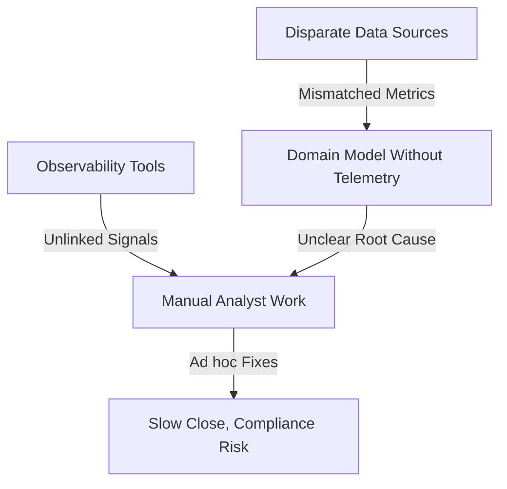
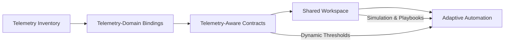
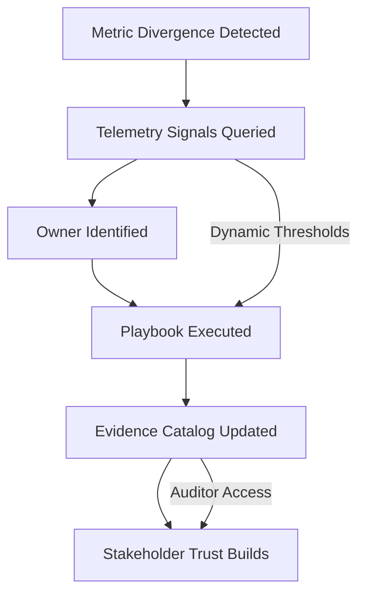

# Telemetry-Led Automation for Reliable Reconciliation

## Problem Introduction
Telemetry data keeps piling up across our pipelines, yet most reconciliation routines still feel like slow manual patchwork. Every time metrics drift or a partner system sends malformed payloads, we scramble through log spelunking and spreadsheet cross-checks to explain mismatched totals. Automated data reconciliation based on domain models promises consistency, but we rarely trust the inputs enough to let algorithms decide the fixes. This post unpacks how rich telemetry streams become the connective tissue for reliable, automated reconciliation, especially when domain models drive rules, thresholds, and remediation playbooks designed for the realities of data professionals shipping analytics everyday at scale.

## Problem Context and Why It Is a Problem
Crunching reconciliation mismatches still depends on heroic analysts exporting CSVs from warehouses, observability dashboards, ERP snapshots, and SaaS billing feeds. Each system emits telemetry differently: some stream granular events with millisecond timestamps, others batch aggregated counts once nightly. Because we rarely normalize the semantics, revenue tallies, inventory levels, and usage entitlements disagree just enough to trigger alarms without telling us which side is wrong. The operational telemetry that could identify the offending pipeline—queue lag, schema drift, retry storms—lives in another tool behind different access controls. So maintenances devolve into Slack threads, copy pasted screen captures, and uneasy executive updates.

Meanwhile, the domain models themselves usually encode business concepts but not the telemetry context we need for trust. A customer order domain may document golden record sources and acceptable currency mappings, yet it rarely includes the lineage breadcrumbs to confirm whether the order completion metric was derived from stream processing, microservice APIs, or backfilled staging tables. Without that instrumentation, automated reconciliation uses static thresholds that ignore dynamic behaviors like seasonality, feature launches, or regional outages. Teams end up silencing alerts or widening tolerances until the automation becomes meaningless, while the root causes remain locked inside telemetry that nobody correlates with the model.

Stakeholders feel the pain everywhere, almost daily now. Finance must certify revenue numbers while fielding ad hoc adjustments from sales. Product ops relies on telemetry to understand feature adoption yet distrusts the reconciled metrics feeding OKRs. Data engineers burn sprint cycles patching lineage DAGs because every reconciliation break is treated as an urgent defect, even when the mismatch represents expected latency from external partners. The business impact compounds: slower closes, delayed customer communications, and compliance risk when auditors probe the gaps between systems of record. All because our automation ignores the telemetry breadcrumb trail that already describes system intent.

## Proposed Approach Introduction
Embedding telemetry directly into reconciliation domain models starts with inventorying every signal already streaming through your stack. Instead of treating observability as a separate concern, map ingestion timestamps, schema evolution events, anomaly scores, and downstream consumer acknowledgements to the same entities the domain model governs. For a payments model, that means linking bank settlement APIs, message broker offsets, and ledger posting results to each transaction aggregate. The goal is to describe not only the data attributes but also the machine-observable behaviors showing how those attributes moved, transformed, and settled. Telemetry becomes the evidence layer that wraps each business rule.

Next, codify telemetry-informed expectations as part of the domain contract. A modern reconciliation model should express invariant relationships—like total invoices equals sum of line items—but also reference the telemetry necessary to validate those invariants automatically. That means embedding thresholds tied to pipeline latency, retry budgets, or external service SLAs, instead of relying solely on static percentage deltas. When a violation occurs, the automation can inspect the correlated telemetry facets, flagging whether the mismatch stems from upstream ingestion gaps, transform logic, or consumer outages. Domain stewards maintain these telemetry bindings alongside semantic definitions, making reconciliation both contextual and adaptive over time.

Finally, expose the enriched model through self-service APIs and notebooks so analytics teams can collaborate on adjustments without hunting through log silos. Provide a telemetry catalog view that surfaces lineage graphs, health scores, and playbooks directly from the domain model repository. Pair it with simulation harnesses that replay historical telemetry patterns to test new reconciliation logic before enabling it in production. This approach gives data professionals a shared workspace where business logic, telemetry evidence, and automated remediation steps live together. The automation then evolves with the ecosystem instead of calcifying as a brittle batch of scripts managed by one hero engineer.

## How the Proposed Approach Solves the Problem
Once telemetry is woven into the domain model, reconciliation automation stops guessing and starts testing hypotheses. When totals diverge, the system checks whether ingestion events for the affected entities arrived on time, whether transformations emitted the expected row counts, and whether downstream consumers acknowledged processing. Those checks narrow the blast radius from dozens of systems to the segment where telemetry shows abnormal behavior. Instead of paging every data engineer, the platform routes alerts to the owner of the failing signal—maybe the streaming team for offset gaps, or the API squad for elevated 5xx rates—because the domain model records that ownership.

Telemetry-enhanced domain models also accelerate remediation because they embed playbooks linked to each signal. Suppose the telemetry indicates an ingestion connector skipped batches after encountering malformed records. The model can trigger automated quarantine jobs, replay the affected window, and annotate the reconciled dataset with lineage metadata documenting the fix. If the issue stems from seasonal demand spikes pushing latency beyond usual thresholds, the automation can apply dynamic tolerances derived from historical telemetry, preventing unnecessary rollbacks. Every resolution updates the telemetry bindings so the model learns new patterns, reducing repetitive incidents and giving auditors a full breadcrumb trail that everyone trusts.

Most importantly, telemetry-driven reconciliation democratizes insights for business stakeholders. Dashboards fed by the domain model can highlight not just whether metrics match, but why they drifted and how the system responded. Finance can view reconciliation status alongside service health indicators before closing the books. Customer success can confirm that credit adjustments processed through the same telemetry-verified pipeline that powers invoices. Compliance teams gain a living control matrix showing evidence of every automated check. When people trust the automated reconciliation, they spend less time debating numbers and more time using them to trigger revenue actions, product experiments, or meaningful retention outreach.

## Oh, I Haven’t Thought That / This Might Not Be for You Because…
Telemetry-first reconciliation sounds great until you confront data gravity. If your telemetry remains trapped in vendor black boxes or aged on-prem schedulers, the effort to harvest, normalize, and store those signals may outweigh short-term benefits. Likewise, organizations with highly regulated data domains must confirm that capturing granular telemetry doesn’t violate retention rules or privacy commitments. Some teams discover that telemetry volume explodes storage costs or that the observability tooling lacks retention controls. Before diving in, model the total cost of ownership, especially when telemetry must be streamed across network boundaries or cross-team governance councils are slow to approve new signals.

This approach also assumes a level of domain ownership maturity that not every organization has embraced. If your domains still blur accountability—marketing, product, and finance all touching the same tables—no amount of telemetry will clarify who tweaks the automation. Teams lacking CI/CD for data models might struggle to version-control telemetry bindings or to test reconciliation playbooks safely. And if you’re early in your data journey, you may need to stabilize source systems and canonical definitions before layering telemetry-driven automation. It’s okay to start with manual runbooks while you build vocabulary and trust metrics; automation should amplify, not replace, that foundation.

## Conclusion and CTA
Telemetry-aware domain models turn reconciliation from a reactive chore into a proactive quality engine. By binding signals, ownership, and automated playbooks to the business logic you already steward, you shrink incident windows and grow trust in every metric powering decisions. Start by cataloging telemetry that already exists, incrementally link it to your domains, and pilot one reconciliation workflow end-to-end. When leaders see faster closes and fewer escalation pings, they’ll back the investment. Ready to experiment? Assemble a tiger team, pick a high-impact metric, and let telemetry drive the next iteration of your automated data reconciliation strategy with measurable business outcomes.

