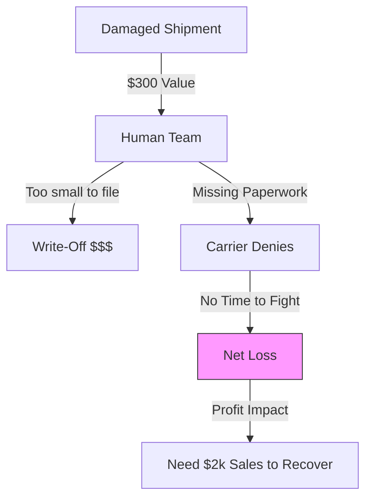
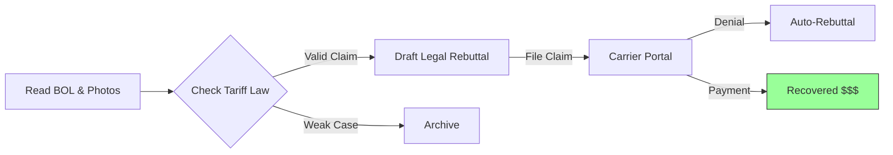

# Get Paid What You're Owed

## The Daily Nightmare: "Leaves It On The Dock"

It’s 4 PM on a Friday. A truck arrives with 4 pallets of electronics. One pallet is tipped over. The shrink wrap is torn. The driver shrugs, "It was loaded like that."

Your receiving clerk is tired. He knows the drill:
1.  Take photos.
2.  Note "Damaged" on the Bill of Lading (BOL).
3.  Scan the docs to the Claims Team.

But the Claims Team is buried. They have 400 open claims. They look at this one: **Value $300.**
*   "It takes me 2 hours to file the paperwork."
*   "The carrier will probably deny it anyway."
*   "I have bigger fires to fight."

So they delete the email. They "Leave it on the dock." **The $300 is gone.**

### The Leakage Math

Most companies write off 2-5% of their freight spend. They call it "Breakage."
But in a low-margin business, a **$100,000 loss** (cumulative small claims) requires **$1.46 million in new sales** just to break even. You aren't just losing cash; you're destroying your sales team's hard work.

## The Solution: A Digital Paralegal

The Runink **Claims Agent** doesn't care if the claim is $300 or $30,000. It fights for every dollar. It doesn't get tired, it doesn't leave early on Fridays, and it never forgets to attach a photo.

## How It Works: The "See, Think, Do" Engine

The agent automates the entire lifecycle of a claim, from the receiving dock to the bank deposit.

### 1. Perception (See)
The agent watches your inbound emails and carrier portals 24/7. It ingests unstructured data.
*   **Reads Documents:** It OCRs every Bill of Lading (BOL) and Delivery Receipt (POD).
*   **Spots Damage:** It notices specific keywords in driver notes: *"1 case crushed," "driver refused inspection," "tipping noted."*
*   **Checks Photos:** It uses Computer Vision to scan arrival photos. "Classification: Crushed Corner. Severity: High."

### 2. Reasoning (Think)
The agent acts like a lawyer. It compares the evidence against the **Carmack Amendment** and the carrier's specific tariff.
*   **The Legal Check:** "The carrier denied this based on 'Act of God' (Weather). I checked the weather report for that route on that day. It was sunny."
*   **The Calculation:** "Invoice value is $400. Shipping cost was $50. Total Claim: $450."
*   **The Rebuttal:** "I will draft a legal rebuttal citing the clean weather report and Carrier Liability Clause 4.2(a)."

### 3. Action (Do)
The agent does the actual manual work that humans hate.
*   **Files It:** Logs into the FedEx/ODFL/Estes portal and key-enters the form fields.
*   **Attaches Proof:** Automatically combines the BOL, Invoice, and Photos into one PDF.
*   **Follows Up:** If the carrier doesn't respond in 30 days, it sends a demand letter.

## "Oh, I Haven’t Thought of That..."

**"Will this annoy my carriers? Will they drop us?"**
No. Carriers actually prefer clear, documented claims over angry, vague emails. The agent files purely based on the contract. It’s business, not personal. It removes the emotion from the fight.

**"What if the agent is wrong?"**
You set the "Autonomy Threshold."
*   **Under $500:** Agent files automatically.
*   **Over $1,000:** Agent switches to **"Draft Mode."** It prepares the email and the evidence, but waits for a human to hit "Approve."

**"Does it work for concealed damage?"**
Yes. It knows the deadline for concealed damage is shorter (5 days vs 9 months). It prioritizes these claims to ensure they are filed before the window closes.

## The Bottom Line

Claims recovery isn't found money. It's *your* money. You just need a tool that can pick it up.

*   **Recovery Rate:** Increase successful claims by 40% immediately.
*   **Labor Savings:** Your team stops acting as data-entry clerks and focuses on operations.
*   **Speed:** Claims are filed within 24 hours of delivery, maximizing your win rate.


