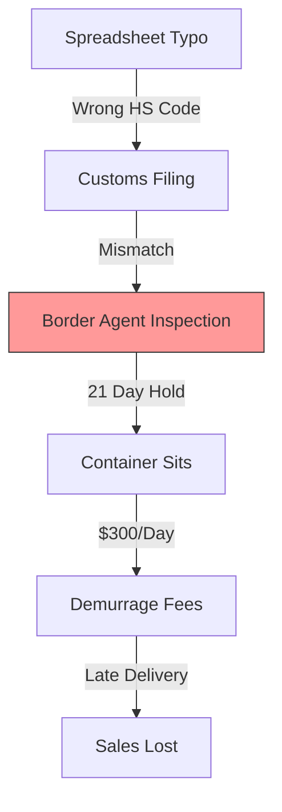
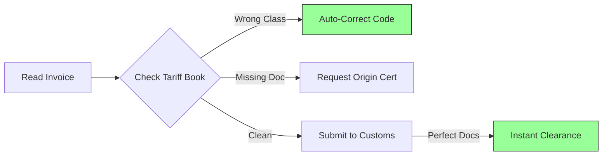

# Stop Getting Stuck at the Border

## The Daily Nightmare: The High Cost of a Typo

Global trade runs on paper. Specifically, the Commercial Invoice and the **HS Code** (Harmonized System Code). These 6-10 digit numbers tell customs exactly what is in your container.

**Imagine this:**
You are shipping a container of "Boy's Cotton T-Shirts" to France.
Your supplier in Vietnam types the code `6205.20` into the spreadsheet.
That code is for *"Men's or Boys' Shirts."*
But France has a specific quota on *Men's* shirts this month.

The container arrives at Le Havre. The Customs Agent sees the code. He flags it.
*   **The Hold:** Your container is pulled for physical inspection.
*   **The Wait:** It sits in the inspection yard for 21 days.
*   **The Fine:** You pay "Demurrage" (storage fees) of $300/day. That’s $6,300 in fines.
*   **The Miss:** You miss the "Back to School" sales window.

All because of one digit.

### The Typo Trap

Humans make typos. Spreadsheets are copy-pasted from old templates. But the border doesn't care about "honest mistakes." A typo looks like fraud to a customs agent.

## The Solution: A Proofreader That Knows The Law

The Runink **Compliance Agent** reads every line of your commercial invoice and double-checks it against the latest global tariff data. It acts as a "Digital Broker."

It catches the typo *before* the paperwork leaves your desk.

## How It Works: The "Customs Broker" Logic

The agent connects to your ERP (for product data) and the Global Tariff Database (for rules).

### 1. It Reads the Invoice
The agent ingests your PDF Commercial Invoice, Packing List, or ASN (Advanced Shipping Notice).
*   **Product Description:** "Boys printed t-shirt, 100% cotton."
*   **Declared Code:** `6205.20`
*   **Destination:** France.

### 2. It Finds the Error
It cross-references the description against the code and the destination rules.
*   **Logic Check:** "Classification Error. Code `6205` is generic. For France, 'Boys Cotton' requires specific code `6207.91`."
*   **Rule Check:** "Alert: France requires a 'Certificate of Origin' for cotton goods this month. Document is missing."

### 3. It Fixes the Paperwork
The agent doesn't just complain; it cleans.
*   **Auto-Correct:** It updates the digital manifest with the correct `6207.91` code.
*   **Flags the Supplier:** *"Supplier X keeps using the wrong code. I sent them a correction notice template."*
*   **Submits:** It hands off the "Clean Data" to your Customs Broker.

## "Oh, I Haven’t Thought of That..."

**"Can the AI go to jail for me?"**
You verify the changes. The agent acts as a "Junior Broker" that prepares the file. You (or your Licensed Customs Broker) hit the final "Submit" button. But now, you're submitting data that has been triple-checked.

**"What about complex items?"**
If the agent isn't 99% sure (e.g., a complex electronic part that could be a "Toy" or a "Computer"), it flags it for human review: *"Ambiguous Classification. Please review."*

**"Does it handle multiple countries?"**
Yes. It knows the difference between specific US, EU, and UK tariff schedules. It adjusts the code based on the destination.

## The Bottom Line

Compliance isn't about paperwork. It's about speed.

*   **Zero Demurrage:** Stop paying rent for containers sitting at the port.
*   **Faster Cash Cycle:** Goods get to the warehouse weeks earlier.
*   **Clean Record:** Stay off the Customs "Watch List." When you file perfect paperwork every time, your containers get the "Green Lane."


