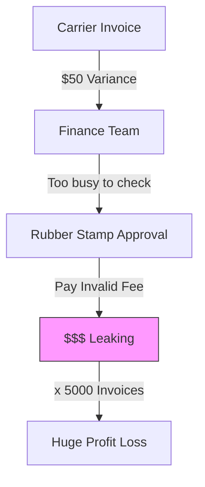
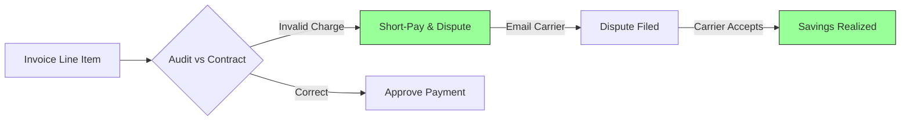

# Stop Paying for Things You Didn't Get

## The Daily Nightmare: The "Rubber Stamp"

In logistics, the price you *quoted* is rarely the price you get *billed*.
*   **Surprise Fees:** "Wait time," "gate fees," "rewtigh fees" appear out of nowhere.
*   **Duplicates:** Carriers send the same bill twice with different ref numbers.
*   **Rate Changes:** Fuel surcharges change between the quote and the ship date.

Your Finance Team is overwhelmed. They receive 5,000 invoices a month. They spend thousands of hours staring at spreadsheets, trying to match lines.
Eventually, they get tired. They set a rule: **"If the variance is under $50, just pay it."**

That is the **Rubber Stamp.** And it is costing you 3-5% of your total freight spend.

## The Solution: An Auditor That Never Sleeps

The Runink **Finance Agent** checks every single line of every single invoice. It doesn't care if the variance is $1 or $1,000. It knows your contracts by heart, and it fights for every penny.

It turns your Accounts Payable from a "Cost Center" into a "Profit Center."

## How It Works: Line-Item Forensic Audit

### 1. It Reads The Bills
The agent digests the mess of paperwork you receive.
*   **Ingests Documents:** It reads PDF invoices, Excel statements, and EDI 210s.
*   **Extracts Details:** It pulls out every accessorial charge (Linehaul, Fuel, Liftgate, Detention).
*   **Normalizes:** It maps "FedEx Fuel" and "UPS Surcharge" to a single "Fuel" category for comparison.

### 2. It Finds The Errors
It catches the things humans miss. It compares the bill against your **Negotiated Rate Card** and the **Proof of Delivery (BOL)**.
*   **Logic:** "Carrier charged $75 for 'Driver Assist'. I checked the BOL, and the 'Driver Assist' box is NOT checked. Validated with GPS timestamp showing driver was onsite for 10 mins. This charge is invalid."
*   **Logic:** "Fuel surcharge is 22%. Based on the DOE Index date of shipment, it should be 21.5%. Discrepancy found."

### 3. It Fixes The Payment
The agent resolves the difference automatically.
*   **Short-Pays:** It authorizes payment for the *correct* amount, not the billed amount.
*   **Disputes:** It sends an email to the carrier: *"We are short-paying Invoice #999 by $75 due to invalid accessorial. Proof attached."*
*   **Approves:** If the variance is tiny (e.g., <$0.50), it auto-approves to keep relations smooth.

## "Oh, I Haven’t Thought of That..."

**"Is Short-Paying Safe?"**
"Will carriers hold my freight if I don't pay the full amount?"
No. Carriers are used to short-pays *if* they are accompanied by clear **Remittance Advice** ("Paid $100 instead of $175 because X"). The Agent provides that clarity instantly. It's actually *better* for them than waiting 60 days for a disputed invoice to be fully paid.

**"Does it integrate with my ERP?"**
Yes. It pushes the "Clean" payment file directly to NetSuite, QuickBooks, or SAP. You just hit "Send Money."

## The Bottom Line

You audit your taxes. You audit your payroll. Why aren't you auditing your freight?

*   **Hard Savings:** Recover 3-5% of total freight spend purely from audit errors.
*   **Speed:** Close your books in days, not weeks.
*   **Accuracy:** Never "Rubber Stamp" a bad invoice again.


