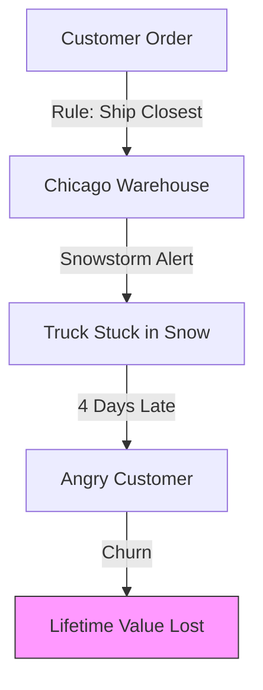
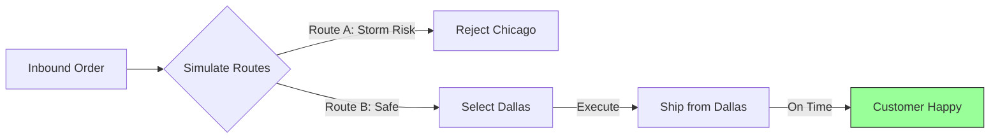

# Fix Problems Before Customers Call

## The Daily Nightmare: The "Dumb Rule" Trap

It’s Cyber Monday. Orders are pouring in. Your Order Management System (OMS) is running on the same logic it has used for 10 years:
**"If Region A has stock, ship from Region A."**

It’s a good rule. Until it isn’t.
*   **The Backup:** Region A has stock, but the dock is backed up for 3 days.
*   **The Storm:** A massive blizzard is hitting the Midwest hub.
*   **The VIP:** The customer is your biggest account, and they need it by Friday.

Your "Dumb Rule" doesn't know about the storm. It doesn't know about the VIP. It just follows the script. It ships from Region A. The package gets stuck in the snow. The customer churns.

### The Cost of Rigid Logic

When you route based on static rules, you are blind to reality.

## The Solution: Intelligent Routing

The Runink **Fulfillment Agent** treats every order as a strategy game. It looks at the whole board—weather, labor, carrier capacity, cost—before it makes a move.

It sits on top of your OMS. It intercepts the order, thinks about it, and *then* tells the warehouse what to do.

## How It Works: The Strategy Engine

### 1. It Watches The Network (Perception)
The agent ingests real-time signals from outside your four walls.
*   **Warehouse Status:** "Chicago dock is 95% full. Processing time is 48 hours."
*   **Carrier News:** "Port Strike alert for Los Angeles. Ground delays expected."
*   **Weather:** "Blizzard warning for I-80 corridor."
*   **Customer Needs:** "This is a VIP customer (LTV > $10k). Priority: High."

### 2. It Simulates Options (Reasoning)
The agent tests different paths before picking one. It runs a "Monte Carlo" simulation for each order.
*   **Simulation A:** "Ship from Chicago. Cost: $12. Risk of Delay: High (Storm)."
*   **Simulation B:** "Ship from Dallas (Secondary DC). Cost: $15. Risk of Delay: Zero."
*   **Decision:** "This is a VIP. The $3 cost is worth saving the relationship. Rerouting to Dallas."

### 3. It Fixes The Problem (Action)
The agent executes the plan automatically.
*   **Re-Routes:** Sends the order to the safer warehouse.
*   **Upgrades Service:** Switches to Air shipping if the ground network is clogged.
*   **Talks to Customers:** Proactively emails them: *"We saw a storm coming, so we upgraded your shipping to ensure it arrives on time."*

## "Oh, I Haven’t Thought of That..."

**"Won't I overspend on shipping?"**
No. The agent optimizes for *Promise Date*. If the cheap route will arrive on time, it *always* picks the cheap route. It only spends extra money when there is a risk of failure. In fact, it saves money by preventing "Panic Upgrades" where you overnight everything because you're scared.

**"Can I cap the spending?"**
Yes. You can set a "Max Upgrade Budget" (e.g., "Never spend more than $5 extra per order").

**"Does it work with Amazon/FBA?"**
Yes. It can optimize split-shipments between your own warehouse and FBA, picking the node that protects the margin.

## The Bottom Line

Fulfillment isn't about moving boxes. It's about keeping promises.

*   **OTIF (On-Time In-Full):** Increase reliability by 15-20% immediately.
*   **Customer Loyalty:** Trust is built when you keep your promises despite the weather.
*   **Smart Spending:** Stop panic-upgrading. Upgrade only what's at risk.


