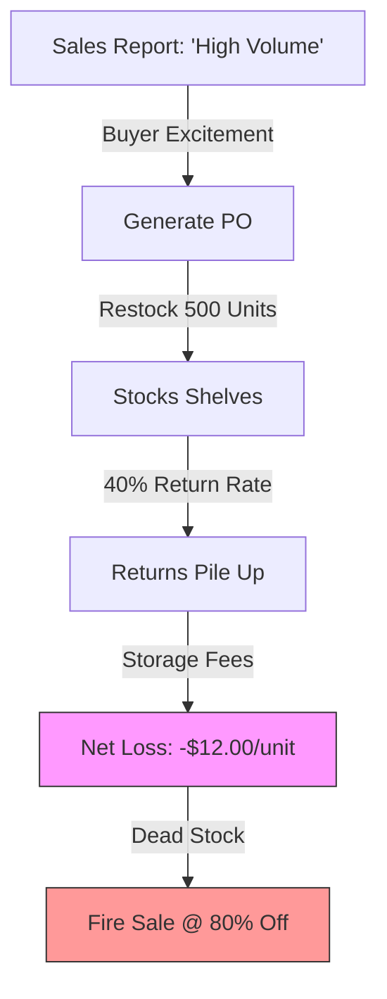
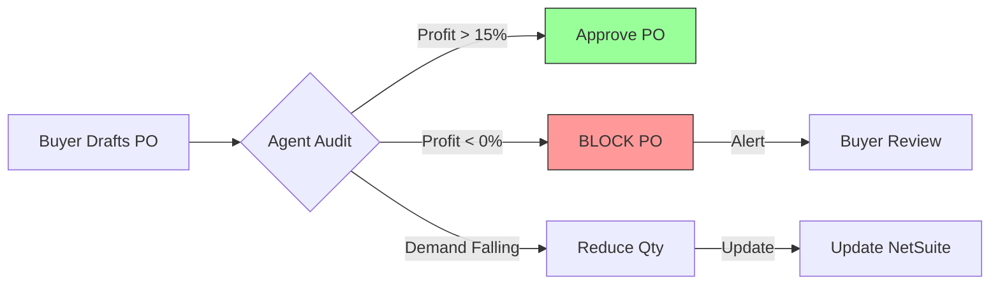

# Stop Buying Dead Stock

## The Daily Nightmare: "Buying on Hype"

It’s Tuesday morning. Your buyer, Sarah, is staring at a spreadsheet with 12,000 SKUs. She has 4 hours to place orders for the next quarter.

She sorts by **"Sales Velocity."** At the top is the *Blue Velvet Sofa*. It’s flying off the shelves. She hits reorder for 500 more units.

**What the spreadsheet didn't tell her:**
1.  **Returns are 40%:** The velvet rips easily. Customers hate it.
2.  **Storage is Expensive:** It’s a bulky item taking up prime rack space.
3.  **Supplier Hiked Cost:** The factory raised prices 15% last week.

Sarah just spent $200,000 of your capital to buy an item that loses $12 on every sale. She didn't do it on purpose. She did it because she was buying blind.

### The Volume Trap

Retail moves fast. When you optimize for "Sales," you ignore "Profit." You fill your warehouse with items that move fast but bleed cash.

## The Solution: Buying for Profit, Not Volume

The Runink **Procurement Agent** audits the *financial health* of a SKU before it allows a reorder. It doesn't care about hype. It cares about one thing: **Net Profit.**

It sits between your buyer and your ERP. When a PO is drafted, the Agent wakes up and runs a forensic audit on every line item.

## How It Works: The "CFO" Logic

The agent doesn't just look at sales history. It builds a **"Profit Profile"** for every SKU in real-time.

### 1. It Sees The Hidden Costs
It connects to your disparate systems to gather the truth.
*   **WMS Connection:** "This item has a 42% return rate over the last 90 days."
*   **Logistics Feed:** "This item is oversized. Storage cost is $14/month per pallet."
*   **Supplier Portal:** "The 'Landed Cost' just went up by $5 due to tariffs."

### 2. It Calculates True Margin
It does the math your spreadsheet can't handle.
*   **Formula:** `(Sales Price - COGS - Shipping - Returns Processing - Storage) = True Margin`
*   **Result:** "The Spreadsheet says Margin is $50. The Truth is Margin is -$12."

### 3. It Blocks The Bad Decisions
The agent acts as a financial guardrail.
*   **Blocks the PO:** It literally prevents the purchase order from being sent.
*   **Alerts the Buyer:** *"I blocked this reorder. Returns are too high. We are losing money on this SKU. See the report."*
*   **Suggests a Fix:** *"Demand is cooling. I adjusted the order from 500 to 100 units to avoid dead stock."*

## "Oh, I Haven’t Thought of That..."

**"Will this slow down my buying team?"**
No. For healthy items (good margin, low returns), the agent auto-approves the PO instantly. Sarah won't even know it's there. It only stops her when she is about to burn cash.

**"What if I *want* to sell at a loss?"**
Sometimes you need a "Loss Leader" to get customers in the door. You can override the agent. But now, you do it with your eyes open, knowing exactly how much it will cost you.

**"Does it work with seasonal items?"**
Yes. The agent sees seasonality curves. If you try to order 10,000 swimsuits in September, it will flag it: *"Trend Alert: Season Ending. Recommended Order: 0."*

## The Bottom Line

This isn't just about saving a few dollars. It's about fundamental capital efficiency.

*   **Cash Flow:** Stop tying up $200k in inventory that will sit for 12 months.
*   **Warehouse Health:** Free up 15% of your rack space for "Winners."
*   **Net Profit:** Increase bottom-line margin by cutting the "silent losers" from your catalog.


