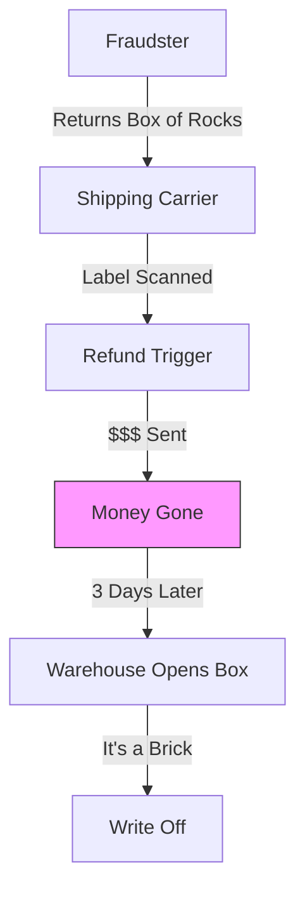
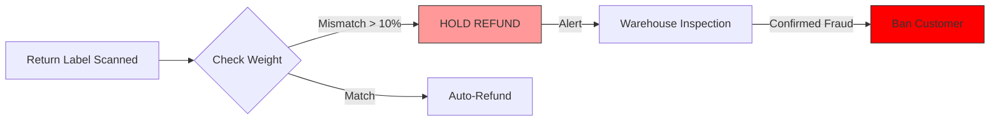

# Stop Taking Back Trash

## The Daily Nightmare: The "Blind Refund"

In the race to be "Customer Obsessed," e-commerce brands have trained customers to expect instant gratification. You buy it, you hate it, you return it, you get paid. Instantly.

But the dishonest 1% have weaponized this kindness.

*   **The Brick:** A customer buys a PS5 ($500). They put a literal brick in the box and ship it back. The carrier scans the label. You refund the $500. Your warehouse opens the box 3 days later. It's too late. The money is gone.
*   **The Swap:** A customer buys a new blender. They return their old, broken blender in the new box.
*   **The Wardrobe:** An influencer buys a gown for a gala. Wears it Saturday. Returns it Monday covered in makeup/perfume.

Your warehouse team is processing 300 returns an hour. They don't have time to be detectives. They scan, refund, and throw it in the "Damaged" bin. You lose the product *and* the money.

### The Fraud Gap

The gap between "Refund Triggered" and "Box Opened" is where you bleed.

## The Solution: Inspect Before You Pay

The Runink **Returns Agent** puts a digital guard at the receiving dock. It acts *before* the refund is triggered. It connects your Carrier Feed, your OMS, and your Warehouse to catch the lie.

## How It Works: The Digital Detective

The agent checks every return against a "Truth Database."

### 1. It Weighs the Evidence
When the carrier scans the label, the agent wakes up.
*   **Weight Logic:** "The product (PS5) weighs 9.2 lbs. The return package weighs 2.1 lbs." -> **RED FLAG.**
*   **Time Logic:** "This return label was created 1 hour after delivery." -> **RED FLAG.**
*   **History Logic:** "This customer has returned 8 of their last 10 purchases." -> **RED FLAG.**

### 2. It Spots the Fraud
It doesn't guess. It compares data points.
*   **Pattern Match:** "Customer address matches a known 'Refund Fraud' forum blacklist."
*   **Swap Detection:** "Serial number on reliability scan does not match sold unit."

### 3. It Holds the Door
The agent stops the theft.
*   **Blocks Refund:** It puts the refund transaction on "Fraud Hold." It does *not* auto-refund.
*   **Alerts the Floor:** It pings the warehouse tablet: *"CHECK THIS BOX. Suspected Fraud (Weight Mismatch)."*
*   **Rejects:** If the inspection confirms fraud, it emails the customer: *"Return denied and account flagged due to item discrepancy."*

## "Oh, I Haven’t Thought of That..."

**"Will this annoy my VIP customers?"**
No. If the weight matches and the customer history is clean, the refund happens instantly. The guard only stops the bad actors. Your best customers still get the "Instant Refund" experience.

**"What if the scale is wrong?"**
The agent has a tolerance threshold (e.g., +/- 5%). Slight variations (tape, extra label) are ignored. Only obvious red flags (bricks vs consoles) stop the flow.

**"Can it handle 'Wardrobing'?"**
Yes. By tracking return *frequency* and *timing* (e.g., returns every Monday), it can flag serial wardrobers for manual inspection ("Check for perfume/stains").

## The Bottom Line

Return fraud isn't "Cost of doing business." It's theft.

*   **Stop the Bleeding:** Cut return fraud losses by 80% in the first month.
*   **Protect Inventory:** Stop restocking used/broken items as "New."
*   **Build a Blacklist:** Automatically flag serial abusers so they can't buy again.


